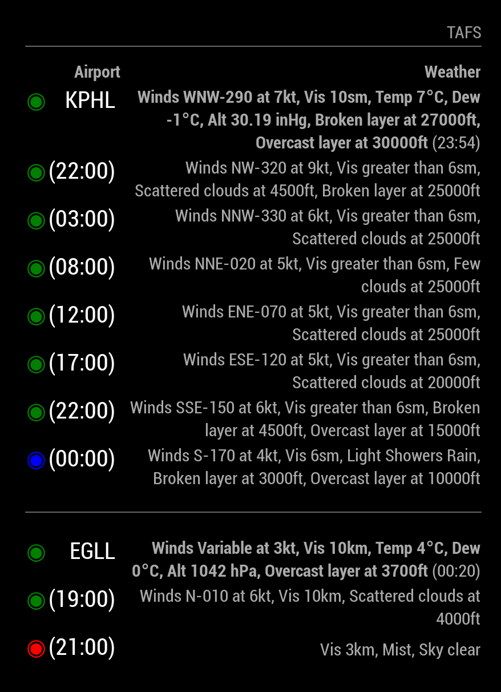

# Module: Magic Mirror TAF (MMM-TAF)

This is a module for <a href="https://github.com/MichMich/MagicMirror">MagicMirror</a>.

`MMM-TAF` displays aviation weather information including both METAR and TAF data on your MagicMirror. It pulls its data from [avwx.rest](https://avwx.rest), 
which is an open source API that pulls from NOAA. Source for AVWX is available [here](https://github.com/flyinactor91/AVWX-API).

This module uses the layout from [MMM-aviationwx](https://github.com/stuloh/MMM-aviationwx) but is not limited to US airports, and parses the results more.

## Screenshot



## Installation

1. Navigate to your MagicMirror `modules` directory.
2. Execute `git clone https://github.com/imperian/MMM-TAF.git`.
3. Add the module to your MagicMirror's `config.js` file (see next section).

## Using the Module

To use this module, add it to the modules array in the `config/config.js` file:

```javascript
modules: [
    ...,
	{
        module: 'MMM-TAF',
        position: 'top_left',
        config: {
            airports: 'KPHL,KGLL', // 4-Letter ICAO only. Will convert 3 letter IATA for US only
            updateInterval: 10, // update interval in minutes
		}
	},
	...
]
```
### Parameters

* `position`: See MagicMirror <a href="https://github.com/MichMich/MagicMirror#modules">documentation</a> for usage.
* `config.airports`: Comma delimited list of 4-character ICAO airport codes. 3-Character US codes should also work.
* `config.updateInterval`: How often the module will pull new data in minutes. Airports generally only update every 60 minutes. Additionally, because of how the <a href="https://aviationweather.gov">Aviation Weather Center</a> provides METAR data, each update pulls down the data for most airports in the continental U.S., so I suggest going easy on the update frequency.

## Notes

* The time displayed at the end of each weather summary is the time of the last weather report (converted to your local time)
## License

`MMM-TAF` is licensed under the Apache License, Version 2.0.
